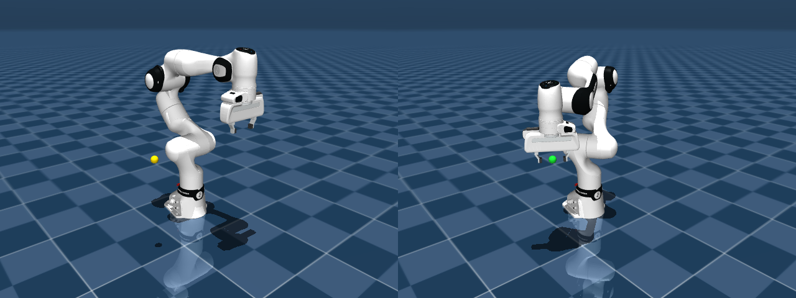
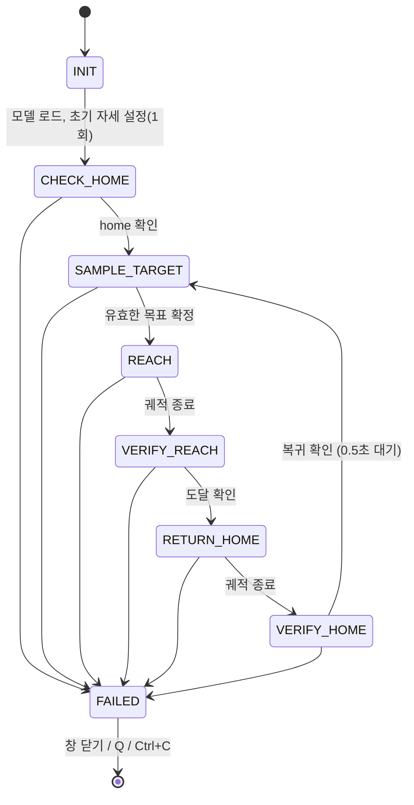

# irobot_ws — MuJoCo FR3 랜덤 목표 reach · home 복귀 시뮬레이션

MuJoCo로 Franka Research 3(FR3) 로봇팔과 Franka Hand를 시뮬레이션합니다. 로봇은 매 사이클 검증된 랜덤 목표점에 엔드이펙터를 보내고, 도달을 확인한 뒤 액추에이터 제어로 home 자세에 돌아옵니다. 이 과정을 사용자가 종료할 때까지 반복합니다. ROS2 없이 MuJoCo Python 바인딩만으로 동작합니다.



*왼쪽: home 자세와 다음 목표(노란 마커). 오른쪽: 목표 도달을 확인한 자세(초록 마커).*

## 특징

- **공식 모델 사용**: Franka Robotics의 [`franka_description`](https://github.com/frankarobotics/franka_description) tag 2.9.0을 스크립트로 MJCF로 변환합니다. 관절 한계, 질량, 관성, 관절 위치가 공식 YAML과 일치하는지 자동으로 검증합니다.
- **실제 제어로 복귀**: home 복귀는 `qpos` 직접 대입이나 리셋이 아니라 position 액추에이터 제어로 이루어집니다. 정적 점검 도구가 금지된 대입과 리셋 호출이 없는지 확인합니다.
- **확정 전에 검증하는 랜덤 목표**: 목표마다 IK를 미리 풀고, 관절 한계 여유, 자기 충돌과 바닥 충돌(경로 포함), 특이점을 검사한 뒤에만 목표로 확정합니다.
- **상태로 판정**: 시간 경과가 아니라 위치 오차, 관절 오차, 속도가 연속으로 유지되는지로 도달과 복귀를 판정합니다. 타임아웃은 실패 판정에만 씁니다.
- **실패하면 즉시 중단**: 수치 발산, 관절 한계 위반, 예기치 않은 충돌, 추종 오차, 상태 불연속, 타임아웃 등을 매 스텝 감시합니다. 하나라도 걸리면 반복을 멈추고 원인을 보고합니다.
- **재현 가능**: 사이클마다 시드를 기록하므로 특정 사이클의 목표를 그대로 다시 실행할 수 있습니다.

## 동작 흐름



다음 목표는 home 복귀가 확인된 뒤에만 생성합니다. 종료 요청(창 닫기, `Q` 키, `Ctrl+C`)은 어느 상태에서든 받아 요약을 남기고 정상 종료합니다.

## 요구 사항

| 항목 | 내용 |
|---|---|
| OS | Ubuntu 22.04에서 검증(GUI 필요, Wayland·X11 모두 가능) |
| Python | 3.12 (`python3.12-venv`) |
| 패키지 | `requirements.lock` (mujoco 3.15.0, numpy, trimesh, pycollada, lxml) |
| 모델 재생성 시에만 | ROS2 Humble의 `xacro` (`/opt/ros/humble`) |

변환된 모델(`models/franka/converted/`)이 저장소에 포함되어 있으므로, 실행만 할 때는 ROS2가 필요 없습니다.

## 설치

```bash
git clone <이 저장소 URL> irobot_ws
cd irobot_ws
python3.12 -m venv .venv
.venv/bin/python -m pip install -r requirements.lock
scripts/run.sh scripts/check_env.py        # 환경 점검 (모두 PASS인지 확인)
```

Python 실행은 항상 `scripts/run.sh`를 거칩니다. 이 래퍼는 작업공간 venv를 사용하고, 다른 venv나 ROS 환경 변수(`PYTHONPATH` 등)가 섞이지 않도록 제거합니다.

## 실행

```bash
scripts/run.sh -m irobot_sim
```

- 뷰어 창에서 로봇이 랜덤 목표로 이동하고 home으로 돌아오기를 반복합니다.
- 마커 색: 노랑 = 이동 중, 초록 = 도달 확인, 파랑 = 복귀 중, 빨강 = 실패.
- 종료: 창 닫기, 뷰어에서 `Q` 키, 터미널에서 `Ctrl+C`. 모두 요약을 남기고 exit 0으로 끝납니다.
- 실패하면 물리가 멈추고 실패 보고가 출력됩니다. 창은 마지막 상태로 남아 있으며, 위 방법으로 종료하면 exit 1입니다.
- 로그는 `logs/run_<시각>.log`(사람이 읽는 용)와 `.jsonl`(분석용)로 남습니다.

자주 쓰는 옵션:

| 옵션 | 용도 |
|---|---|
| `--seed S` | 마스터 시드 고정(생략하면 무작위로 정하고 로그에 기록) |
| `--seed S --replay-cycle K --max-cycles 1` | 시드 S의 K번째 사이클 재현 |
| `--headless --max-cycles N` | 뷰어 없이 N사이클만 빠르게 실행(검증용) |
| `--fixed-target x,y,z` | 고정 목표 1점(검증용) |

전체 옵션은 `scripts/run.sh -m irobot_sim --help`로 볼 수 있고, 튜닝값은 [`config/sim.toml`](config/sim.toml)에 있습니다.

## 검증 결과 (2026-10-07, 이 저장소 기준)

| 검증 | 결과 |
|---|---|
| 모델 vs 공식 YAML(관절 한계, 질량, 관성, 관절 위치) | 12/12 PASS, 오차 1e-14 수준 |
| 랜덤 목표 50사이클 × 시드 1, 2, 3 | 150/150 성공. 도달 위치 오차 최대 1.01 mm, 복귀 관절 오차 최대 0.00009 rad |
| 추종 오차 | 최대 0.0041 rad (실패 임계값 0.022 rad) |
| 실패 주입 9종(도달 불가, 바닥 충돌, NaN, 상태 점프, 외란 토크 등) | 9/9 기대한 실패 유형으로 반복 중단 + 원인 보고 |
| 금지 사항 정적 점검(`qpos`/`qvel` 대입, 리셋 호출) | 위반 0건 |

검증 도구:

```bash
scripts/run.sh scripts/inspect_model.py [--view]   # 모델 검증(+ 뷰어)
scripts/run.sh scripts/analyze_log.py [로그]       # 순서, 판정값, 복귀 연속성, 추종 오차
scripts/run.sh scripts/check_forbidden.py          # 금지 사항 정적 점검
scripts/run_stage1c.sh                             # 실패 주입 9종
```

`inspect_model.py`의 공식 YAML 비교는 원본이 있어야 합니다. 먼저 `scripts/fetch_model.sh`(git만 필요)를 실행하세요. 원본이 없으면 그 항목만 SKIP으로 표시합니다.

## 제어와 판정 요약

- **목표**: 베이스 앞쪽 원통 영역(r 0.30–0.70 m, ±90°, z 0.15–0.65 m)에서 샘플링합니다. 그리퍼는 아래를 향하고, z축 회전(yaw)은 랜덤입니다.
- **제어**: IK로 목표 관절값을 구한 뒤, 관절공간 quintic 궤적을 position 액추에이터로 추종합니다. 입력은 `ctrl = q_ref + (kv/kp)·q̇_ref`이고, 중력 보상을 씁니다.
- **도달 판정**: 위치 오차 < 3 mm, 방향 오차 < 2°, 관절 속도 < 0.02 rad/s가 0.25초 연속 유지되면 도달로 봅니다.
- **복귀 판정**: 관절 오차 < 0.005 rad, 관절 속도 < 0.02 rad/s가 0.25초 연속 유지되면 복귀로 봅니다.

설계와 결정 근거: [`docs/DESIGN.md`](docs/DESIGN.md), [`docs/DECISIONS.md`](docs/DECISIONS.md). 실행 방법 상세: [`docs/RUN.md`](docs/RUN.md).

## 디렉터리 구조

```
irobot_ws/
├── config/sim.toml          # 튜닝값(허용 오차, 타임아웃, 게인, 목표 영역)
├── src/irobot_sim/          # 시뮬레이션 코드(상태 머신, IK 플래너, 판정·감시, 실행 루프)
├── scripts/                 # 실행 래퍼, 환경 점검, 모델 확보·변환, 검증 도구, 실패 주입
├── models/franka/
│   ├── converted/           # 변환된 URDF, 메시(OBJ/STL), MJCF(scene.xml)
│   ├── SOURCE.md            # 원본 출처, 버전, 변경 사항
│   └── LICENSE, NOTICE      # 원본(franka_description) 라이선스
├── docs/                    # 설계, 결정 기록, 실행 방법, 이미지
└── logs/                    # 실행 로그(저장소에 포함하지 않음)
```

## 모델 재생성 (선택)

변환된 모델은 저장소에 이미 들어 있습니다. 원본에서 다시 만들려면 ROS2 Humble의 `xacro`가 필요합니다.

```bash
scripts/fetch_model.sh                    # 공식 원본을 models/franka/source/ 에 받음(tag 2.9.0, SHA 검증)
scripts/run.sh scripts/build_model.py     # Xacro 전개 → 메시 변환 → MJCF 생성
scripts/run.sh scripts/inspect_model.py   # 검증
```

## 알려진 제한

- Wayland에서 뷰어 창이 다른 창에 완전히 가려지면 화면 갱신과 함께 시뮬레이션도 잠시 멈춥니다. 창이 다시 보이면 이어서 진행합니다.
- 뷰어의 Backspace(리셋)는 상태 불연속으로 감지되어 실패로 처리됩니다. 의도된 동작입니다.
- 그리퍼는 열린 상태로 고정되어 있으며, 물체 집기는 다루지 않습니다.

## 라이선스

- 이 저장소의 코드는 [Apache License 2.0](LICENSE)을 따릅니다.
- `models/franka/`의 모델은 Franka Robotics GmbH의 `franka_description`(Apache-2.0)을 변환한 것입니다. 원본 라이선스는 [`models/franka/LICENSE`](models/franka/LICENSE)에, 변경 사항은 [`models/franka/SOURCE.md`](models/franka/SOURCE.md)에 있습니다.
- 자세한 고지는 [NOTICE](NOTICE)를 참조하세요.
